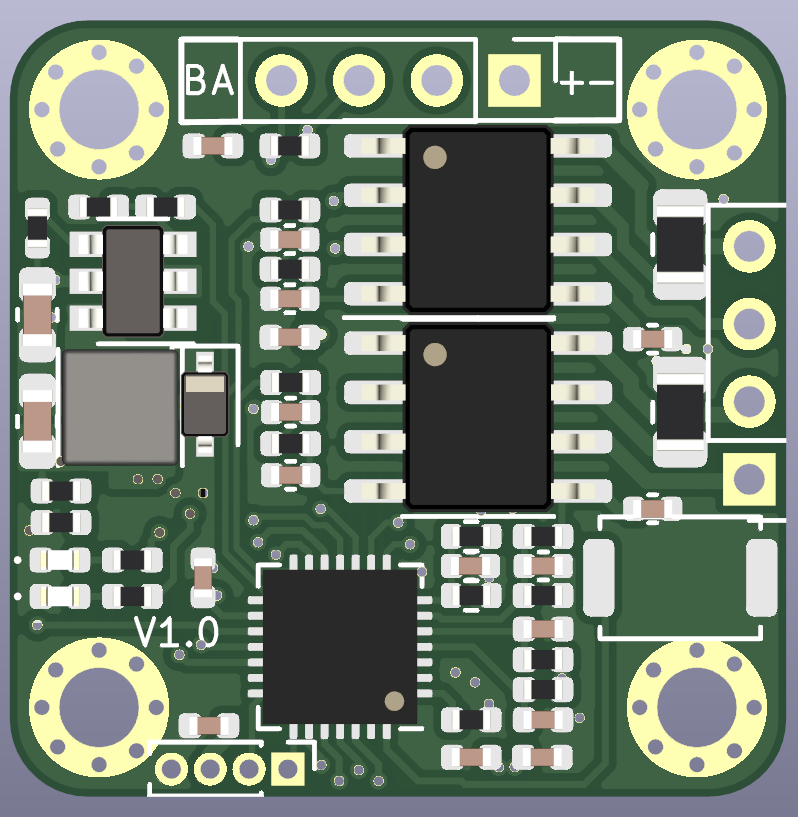

# Stepper Motor mini

A very simple and low-cost  stepper motor controller based on [dummy robot](https://gitee.com/switchpi/dummy)


## How to build

build on Windows

1. Download toolchain from https://github.com/xpack-dev-tools/arm-none-eabi-gcc-xpack/releases and unzip it.
2. run follow command to build
    ```shell
    mkdir build
    cmake -G "MinGW Makefiles" ..
    ```

## Feature

- Power: 12v~24v
- 2-layer board
- mini size
- Modbus support

## Preview

<center>
<figure>

·
·
·

</figure>
</center>


## Uasge

### Button Functions

| Action     | Function              |
| ---------- | --------------------- |
| click      | toggle to run or stop |
| long press | restore settings      |


### calibration

push down the button then power on, the motor well start to calibration sensor.


### Modbus Register


